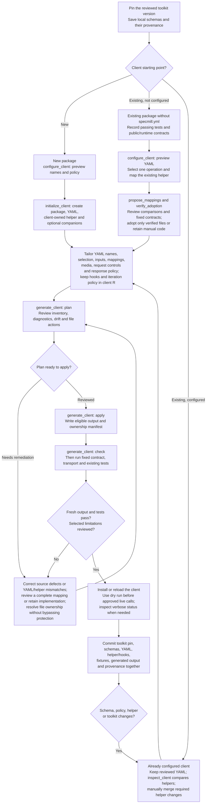

# Workflow flowcharts

These charts describe [specmill v0.1.9](https://github.com/seanthimons/specmill/releases/tag/v0.1.9).
Use the first chart to create, adopt, tailor, or update a client. Use the second
to trace a wrapper from schema discovery through generation and runtime behavior.
The [site article](https://seanthimons.github.io/specmill/articles/workflow.html)
renders the charts; GitHub also renders the Mermaid blocks in this source.

## Create and maintain a client



`configure_client()` and `propose_mappings()` default to read-only proposals.
Initialization writes immediately; use it for a new package. Configuration apply
creates absent files and refuses conflicts, so merge changes into existing YAML
yourself. For multiple APIs, review `configure_apis()` before configuration or
initialization; each included API gets its own YAML with nested tag groups.

Adoption has two paths. Reviewed legacy generated files can use exact adoption
hashes. Hand-written wrappers use `verify_adoption()` comparisons and its returned
contracts/files before replacement, as described in the
[existing-client guide](https://seanthimons.github.io/specmill/articles/existing-clients.html#6-verify-and-expand).
Keep wrappers that cannot be verified with `implementation: existing` and an
explicit public contract. Do not bulk-delete protected files or hash them merely
to remove a warning.

Tailoring belongs in reviewed YAML and client-owned R, rather than generated
wrappers. YAML selects names, arguments, mappings, supported encodings and policy
functions. R supplies executable hooks, response/retry functions, custom helpers,
and explicit batching/pagination policies. New clients can select
`companions = c('batching', 'pagination')` at initialization; existing helpers
need manual adoption. Ordinary wrappers still make one helper call, and a `page`
argument alone does not create a loop. Emitted companions run without specmill.

A successful `check` establishes output freshness, not API compatibility or
absence of diagnostics. Contract tests check helper calls; transport tests check
serialized requests and response behavior. Dry runs still validate inputs and
authentication, and prepared requests may contain credentials. Regeneration
does not refresh client-owned transport, hooks, session controls, or companions.

## Trace the underlying pipeline

The upper section runs during development. The lower section runs in the
generated client without specmill. It describes the standard renderer and current
request helper; retained implementations, custom renderers, and custom helpers
can have their own behavior.

```mermaid
flowchart TD
    accTitle: Trace specmill generation and client runtime
    accDescr: Schema discovery and policy selection lead to parsing, diagnostics, mappings, rendering and ownership checks. Installed wrappers validate inputs, run hooks and optional guards, then call client transport and response policy.
    subgraph Generation["Development: specmill generation"]
        Load["load_project<br/>Validate project/API/service/group YAML;<br/>resolve helpers, callbacks and schema files"]
        Files["Schema discovery<br/>Explicit files + patterns, minus schemas.exclude"]
        Policy["Resolve policy<br/>Methods intersect; path exclusions accumulate;<br/>defaults merge before operation overrides"]
        Routes["Resolve declared hook routes, when present<br/>Check schema identity, helper, server and body media"]
        Read["read_operations<br/>Read local JSON/YAML; check version and paths;<br/>resolve path items and enumerate METHOD /path"]
        Select{"Included, allowed method,<br/>and no excluded path match?"}
        Excluded["inventory: excluded / policy_exclusion<br/>Skip detailed operation parsing"]
        Parse["Parse selected operation and local references<br/>Drop reviewed exclude_parameters;<br/>resolve parameters, body, security, server and response metadata"]
        Supported{"Fits the supported subset?"}
        Native["Supported operation records<br/>Shared endpoint-table parser + validated metadata"]
        Diagnose["Record unsupported operation / diagnostic<br/>classification, code, source_location and guidance"]
        Recovery{"Reviewed handling?"}
        Mapped["Complete inputs + request mapping<br/>Eligible metadata becomes client-mapped;<br/>keep mapping_diagnostics"]
        Retain["implementation: existing<br/>Keep declared manual source;<br/>keep retained_diagnostics for unsupported metadata"]
        Blocked["Leave unsupported operation visible<br/>Do not generate it or delete previous output"]
        Configure["configure_operation<br/>Apply names, public inputs, mappings, hooks,<br/>request/response policy and route guard settings"]
        Render["Validate public names, definitions and helper arguments<br/>Render wrappers and supplied contract tests;<br/>stage docs and configured formatting"]
        Reconcile["Reconcile candidate output with manifest and local files<br/>Protect unowned/edited/lifecycle files;<br/>review explicit exclusions and renames"]
        Mode{"Generation mode?"}
        Plan["plan: return candidate actions and evidence<br/>No client changes"]
        Check["check: error on stale/protected output<br/>Review diagnostics separately"]
        Apply["apply: lock, revalidate inputs, back up and write<br/>Record hashes and declared route provenance"]

        Load --> Files --> Policy --> Routes --> Read --> Select
        Select -->|No| Excluded
        Select -->|Yes| Parse --> Supported
        Supported -->|Yes| Native --> Configure
        Supported -->|No| Diagnose --> Recovery
        Recovery -->|Eligible complete mapping| Mapped --> Configure
        Recovery -->|Retain manual contract| Retain --> Configure
        Recovery -->|No reviewed handling| Blocked
        Configure --> Render --> Reconcile --> Mode
        Mode -->|plan| Plan
        Mode -->|check| Check
        Mode -->|apply| Apply
    end

    subgraph Runtime["Runtime: generated wrapper and client-owned code"]
        Call["Call installed wrapper<br/>Optional explicit companion orchestrates repeated calls"]
        Inputs["Validate public inputs<br/>Capture params"]
        Pre["Optional pre_request hooks<br/>Update params or hook_state; may skip the request"]
        Skip{"skip_request?"}
        Skipped["Use hook-provided result<br/>post_on_skip selects whether post hooks run"]
        Guard["Build final helper arguments<br/>Optional route_guard checks reviewed METHOD /path"]
        Helper["Client request helper<br/>Resolve runtime options, URL, timeout/retry policy;<br/>serialize params/body and authenticate"]
        Dry{"Dry run?"}
        Prepared["Return prepared request<br/>No HTTP or response policy"]
        HTTP["Send HTTP<br/>Apply configured bounded retries when permitted"]
        Response["Final response<br/>Selected response_policy may replace result<br/>or delegate to status checks and decoding"]
        Post["Optional post_response hooks<br/>Shape the helper result"]
        Result["Return result"]

        Call --> Inputs --> Pre --> Skip
        Skip -->|No| Guard --> Helper --> Dry
        Skip -->|Yes| Skipped
        Skipped -->|post_on_skip is false| Result
        Skipped -->|post_on_skip is true| Post
        Dry -->|Yes| Prepared --> Post
        Dry -->|No| HTTP --> Response --> Post --> Result
    end

    Apply -.->|Install or reload eligible output| Call
```



The chart shows the main flow, not every error exit. Invalid configuration,
unreadable documents, broken document structure, collisions, incompatible
definitions, or changing inputs can stop generation before it returns a plan.
Operation-level failures normally remain in the inventory. Runtime validation,
guard, authentication, transport, policy, and decoding errors propagate; a
post-response hook is not an error handler.

Declared route resolution may inspect targets excluded from wrapper generation.
All targets must belong to the service's loaded schemas and agree with the keyed
route's effective helper, resolved schema server, body media and text encoding.
Declarations record provenance; they do not select extra wrappers or enforce
runtime choices. `route_guard` is opt-in and checks final mapped method/path
after pre-hooks, before the helper. Skipped requests bypass it. It does not check
server destinations, redirects, parameters or changes inside a custom helper.

Complete request mappings own every helper argument, including authentication,
server and response-policy bindings. They can bridge eligible parser limitations
but cannot repair malformed metadata or broken references. Retention preserves
source and checks the declared public interface; it does not make the manual
implementation schema-compliant.

## Find the source of a wrapper's behavior

Start with a fresh plan using the same callbacks as normal generation:

```r
plan <- specmill::generate_client(root, config = 'specmill.yml', mode = 'plan')
plan$inventory
plan$operations
plan$diagnostics
plan$mapping_diagnostics
plan$retained_diagnostics
plan$server_diagnostics
plan$drift
plan$files
```

Use `service` and the original `key` such as `GET /items/{item_id}` to find the
operation before looking up its public R name. `status` describes selection or
mapping disposition; `classification` explains the parser finding. A mapped or
retained operation can keep its original limitation classification.

| Observed behavior | Inspect and remediate |
|---|---|
| Schema or endpoint is missing | Check `load_project(root)$services`, `schemas.files`, `patterns`, and filename exclusions first. Then inspect inventory selection reasons. |
| Endpoint is excluded despite an `include` entry | Methods intersect across project/API/group or service; path exclusions accumulate. An exact include cannot restore a prohibited operation. |
| Selected endpoint has no generated wrapper | Read `diagnostics` classification, code, source location and guidance. Correct source defects; review complete mappings for capability gaps or explicitly retain manual code. Unsupported status alone never authorizes removal. |
| Name, argument, default or output file differs | Inspect resolved defaults and the operation's `names`, `parameters`, `inputs`, `request` and `file` settings. Later defaults/operation settings override earlier ones. `drift` reports public-formal differences. |
| Schema parameter is absent | Check per-operation `exclude_parameters`, inventory `excluded_parameters`, and public input/parameter overrides. Schema exclusions happen before detailed parameter validation; path parameters cannot use `exclude_parameters`. |
| Hook calls another endpoint | Inspect inventory `routes`, manifest route provenance, request bindings and pre-hook state. Declare reviewed targets and opt into `route_guard` if final method/path must be checked. |
| Request goes to another server | Check runtime `<package>.request$base_url`, initialization/catalogue override, then operation/path/root schema servers and `server_diagnostics`. A method/path guard does not control the server. |
| Timeout or retry behavior differs | Runtime request options override YAML defaults per field. Inspect `max_retries`, `retry_writes` and the selected client `retry_policy`; a predicate does not grant write replay permission. |
| Result type or HTTP-error handling differs | Inspect actual response Content-Type, generated `response_policy` selection, helper option/default, and post hooks. A policy runs after retries, may replace decoding/status handling, and is separate from post-response hooks. |
| One page or one oversized body is returned/rejected | Wrappers do not infer iteration. Body `batch` limits validate size without splitting. Select explicit client-owned batching/pagination companions and bounded policies for repeated requests. |
| Plan reports protected or retained files | Compare local content and manifest ownership; use reviewed adoption or keep a manual implementation. Protected replacement/removal and retained implementation are separate concepts. |
| Fresh output still behaves like the old client | Install/reload the generated client, then inspect its actual helper/hooks/options. `inspect_client(root)$helpers` compares helper baselines when known; generation never silently updates those files. |

For detailed examples, use [configuration](https://seanthimons.github.io/specmill/articles/configuration.html),
[runtime hooks](https://seanthimons.github.io/specmill/articles/hooks.html),
[testing](https://seanthimons.github.io/specmill/articles/testing.html), and
[troubleshooting](https://seanthimons.github.io/specmill/articles/troubleshooting.html).
